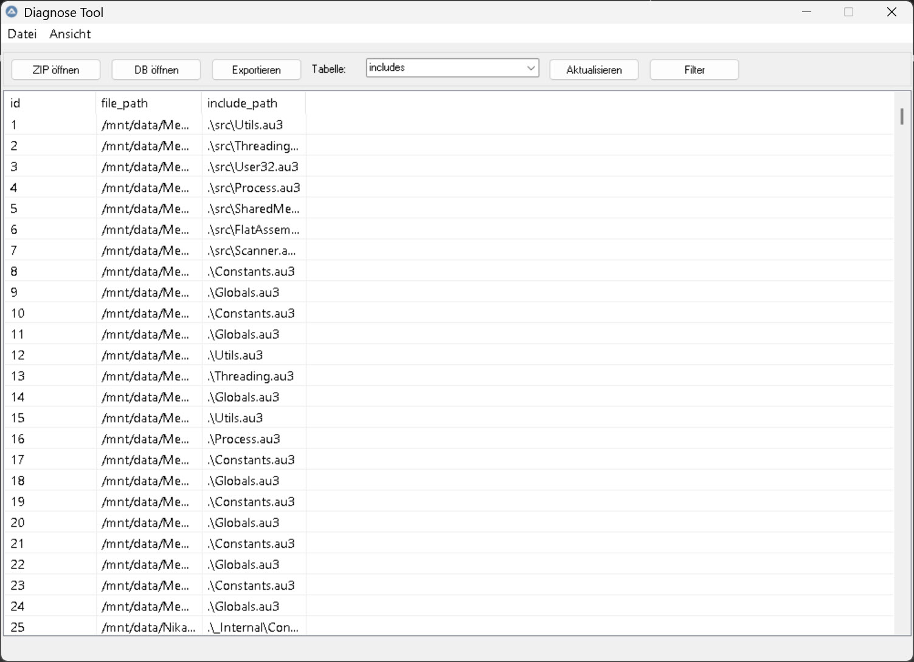
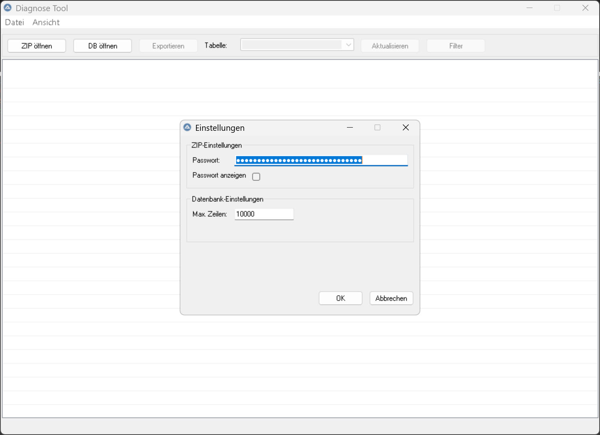
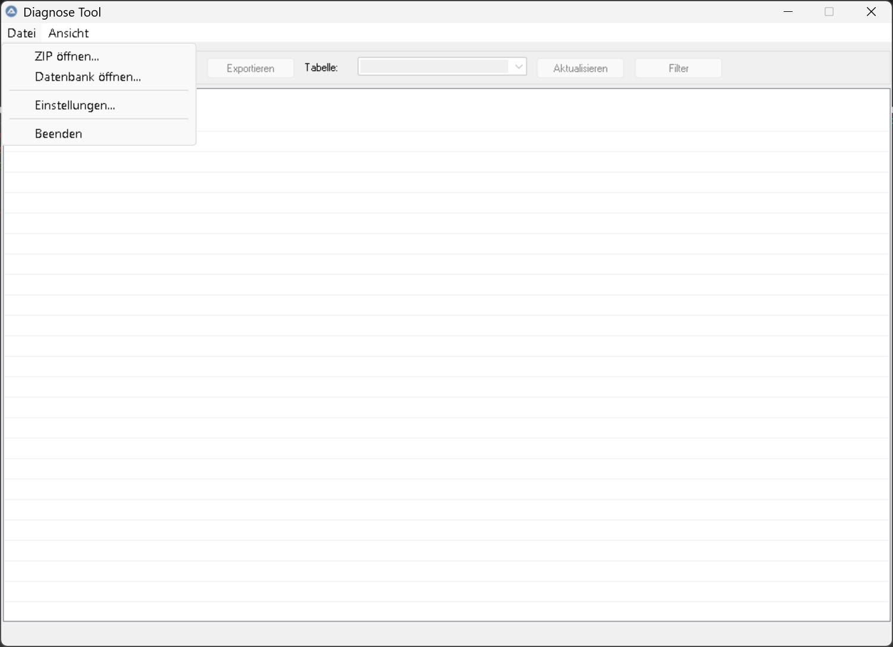
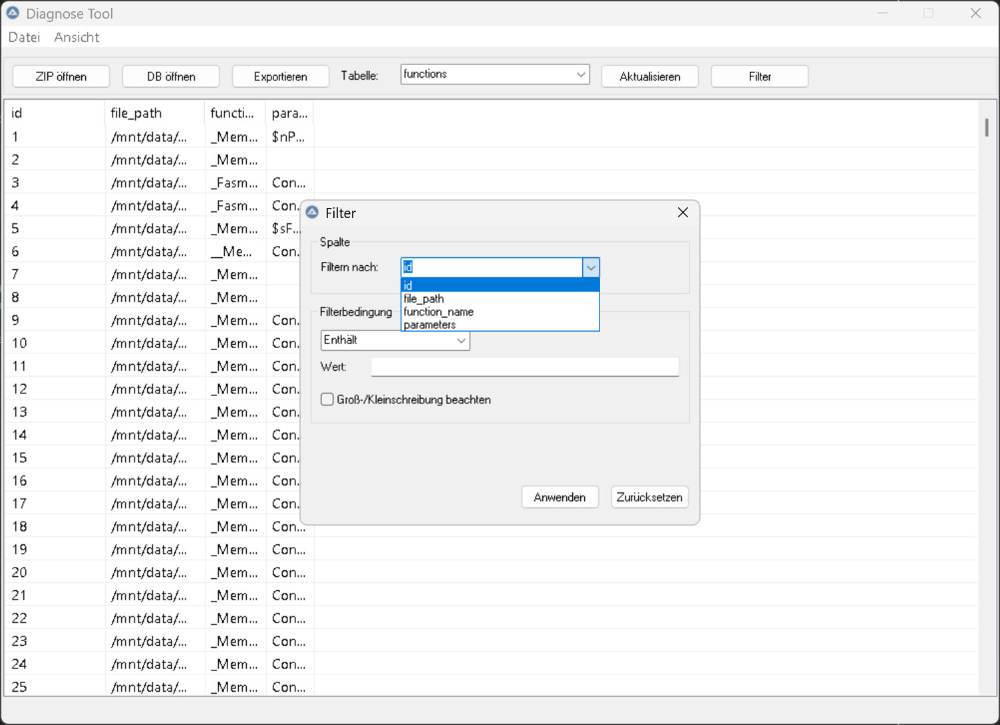
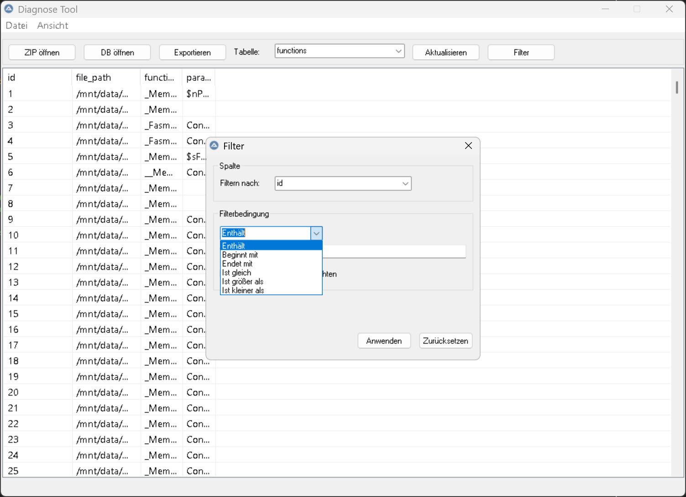
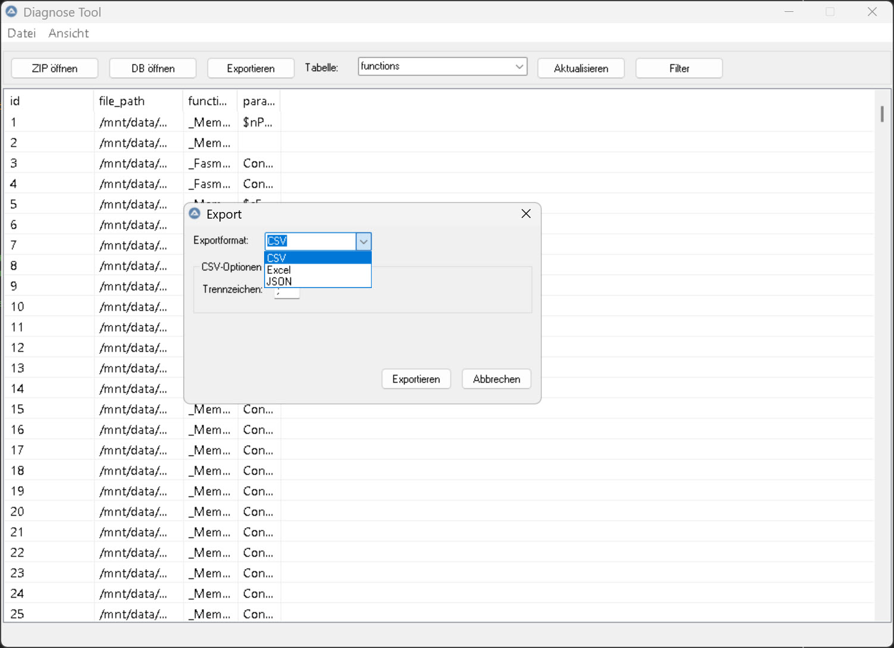

# Diagnose-Tool

## Übersicht
Das Diagnose-Tool dient der Analyse und Verarbeitung von passwortgeschützten ZIP-Dateien mit SQLite-Datenbankstützung. Es ermöglicht das Entpacken von ZIP-Dateien, das Laden und Anzeigen von Datenbankdaten sowie deren Analyse in einer benutzerfreundlichen Oberfläche.



## Funktionen

- **ZIP-Verarbeitung**: Entpacken von passwortgeschützten ZIP-Dateien mit 7-Zip Integration
- **SQLite-Datenbankanalyse**: Anzeigen und Durchsuchen von Tabellen aus SQLite-Datenbanken
- **Datenexport**: Export von Tabellendaten in verschiedene Formate
- **Filter**: Umfangreiche Filteroptionen für Datenbankinhalte
- **Automatische 7-Zip Installation**: Automatisches Herunterladen und Installieren von 7-Zip bei Bedarf
- **Direkte Datenbanköffnung**: Möglichkeit, SQLite-Datenbanken (*.db, *.db3) direkt zu öffnen

## Installation

1. Laden Sie die neueste Version des Diagnose-Tools von GitHub herunter
2. Entpacken Sie die Dateien in ein Verzeichnis Ihrer Wahl
3. Starten Sie die Anwendung mit einem Doppelklick auf die `.exe`-Datei (oder führen Sie die `.au3`-Datei mit AutoIt aus)

## Voraussetzungen

- Windows 10/11
- AutoIt 3.3.16.1 oder höher (nur für die Entwicklung)
- 7-Zip Kommandozeilenprogramm (wird bei Bedarf automatisch heruntergeladen)

## Konfiguration

Das Tool verwendet eine `settings.ini`-Datei für verschiedene Einstellungen:

```ini
[ZIP]
password=IHRE_PASSWORT_HIER_EINTRAGEN
[PATHS]
temp_dir=..\temp
extract_dir=..\temp\extracted
[DATABASE]
max_rows=10000
chunk_size=1000
[GUI]
show_progress=1
auto_clear_temp=1
[EXPORT]
excel_template=..\templates\default.xlsx
csv_delimiter=;
```

**Wichtig**: Tragen Sie Ihr ZIP-Passwort in der `settings.ini`-Datei ein. Achten Sie darauf, diese Datei nicht öffentlich zu teilen!



## Verwendung

1. Starten Sie das Diagnose-Tool
2. Klicken Sie auf "ZIP öffnen" und wählen Sie eine ZIP-Datei aus, oder
   Klicken Sie auf "DB öffnen" zum direkten Öffnen einer SQLite-Datenbank

   

3. Die enthaltenen Datenbanken werden automatisch erkannt und geöffnet
4. Wählen Sie eine Tabelle aus dem Dropdown-Menü
5. Die Daten werden in der Tabellenansicht angezeigt
6. Nutzen Sie die Filter- und Exportfunktionen nach Bedarf

   
   

7. Exportieren Sie die Daten in verschiedene Formate

   

## Projektstruktur

```
diagnose-tool/
│
├── src/                     # Quellcode
│   ├── 7za.exe              # 7-Zip Kommandozeilenprogramm
│   ├── 7za.dll              # 7-Zip Bibliothek
│   ├── main.au3             # Hauptanwendung
│   ├── settings.ini         # Einstellungsdatei
│   ├── images/              # Bilder für die Dokumentation
│   └── lib/                 # Bibliotheken und Module
│       ├── db_functions.au3   # Datenbankfunktionen
│       ├── db_functions_ext.au3 # Erweiterte DB-Funktionen
│       ├── zip_handler.au3    # ZIP-Verarbeitung
│       ├── 7z_functions.au3   # 7-Zip Funktionen
│       ├── logging.au3        # Logging-System
│       └── ...                # Weitere Module
│
├── temp/                    # Temporäre Dateien (werden automatisch erstellt)
└── doc/                     # Dokumentation
```

## Entwicklung

Das Projekt ist in AutoIt 3 geschrieben und modular aufgebaut. Die Hauptmodule sind:

- `main.au3`: Hauptanwendung und GUI
- `db_functions.au3`: Datenbankzugriff und -anzeige
- `db_functions_ext.au3`: Erweiterte Datenbankfunktionen
- `zip_handler.au3`: Verarbeitung von ZIP-Dateien
- `7z_functions.au3`: 7-Zip Download und Installation
- `system_functions.au3`: Systemfunktionen (Initialisierung, Aufräumen)
- `logging.au3`: Protokollierungssystem

## Kontakt und Support

- Projektverantwortlicher: Ralle1976
- Repository: https://github.com/Ralle1976/diagnose-tool/